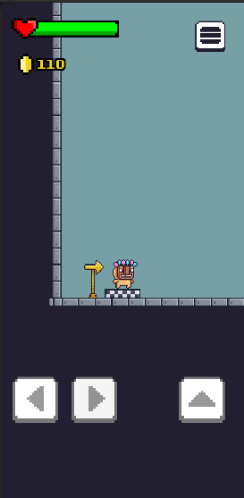

# MyUnityPlatformer

## Description
**MyUnityPlatformer** is a thrilling platformer game developed with Unity. Dive into an exciting adventure with challenging levels, stunning graphics, and smooth gameplay. This project is designed to be a great starting point for learning and exploring game development using Unity.

## Table of Contents
- [Prerequisites](#prerequisites)
- [Installation](#installation)
- [Running the Game](#running-the-game)
- [Contributing](#contributing)
- [Credits](#credits)
- [License](#license)
- [Preview](#preview)

## Prerequisites
Before you begin, make sure you have the following installed on your machine:
- [Unity Hub](https://unity3d.com/get-unity/download)
- Unity Editor (working with version **2022.3.14f1**)
- Git

> [!NOTE]
> It's recommended to use **Unity version 2022.3.14f1** to ensure compatibility and stability.

## Installation
1. Clone the repository to your local machine using Git:
   ```bash
   git clone https://github.com/CorentinL5/MyUnityPlatformer.git
   ```
2. Open Unity Hub and click on the `Add` button to add the cloned project.
3. Navigate to the folder where you cloned the project and select it.
4. Open the project with the recommended Unity version (2022.3.14f1).

> [!WARNING]
> Make sure you have enough disk space and a stable internet connection to download and open the project in Unity.

## Running the Game
1. Ensure the project is open in Unity Editor.
2. In the `Project` window, navigate to the `Scenes` folder.
3. Double-click on the `MainScene` to open it.
4. Click on the `Play` button at the top of the editor to start the game.

## Contributing
Contributions are welcome! To contribute:
1. Fork the project.
2. Create a branch for your feature (`git checkout -b feature/AmazingFeature`).
3. Commit your changes (`git commit -m 'Add some AmazingFeature'`).
4. Push your branch (`git push origin feature/AmazingFeature`).
5. Open a Pull Request.

> [!NOTE]
> Ensure your code follows the project's coding standards and includes relevant documentation. 

## Credits
### ASSETS USED

#### Graphics

- **Tilesheet**: Pixel Adventure by *Pixel Frog*
- **Health Bar**: by *Brackeys Team*
- **PNJs**: by *Lucas*
- **Props**: by *Zef and Tarumo*

#### Audio 
- **RPG Music Asset Collection**: by **...**
- **FreeSFX**: by **...**

#### Graphics

- **PixeloidSansBold**: by *GGBotNet*

### Special Thanks

- **Game Reviews**: Ethan, Lucas, Valentin

## License
This project is licensed under the MIT License. See the [LICENSE](LICENSE) file for details.

## Preview
<div align="center">
    
</div>

---

Thank you for checking out **MyUnityPlatformer**! Have fun developing and playing the game.

---

> [!CAUTION]
> The project is no longer active. You can try the APK app in the `.build/` directory [here](.build).
